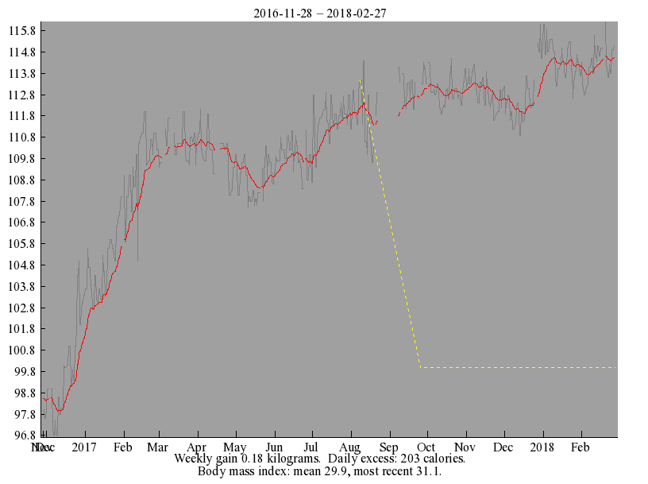
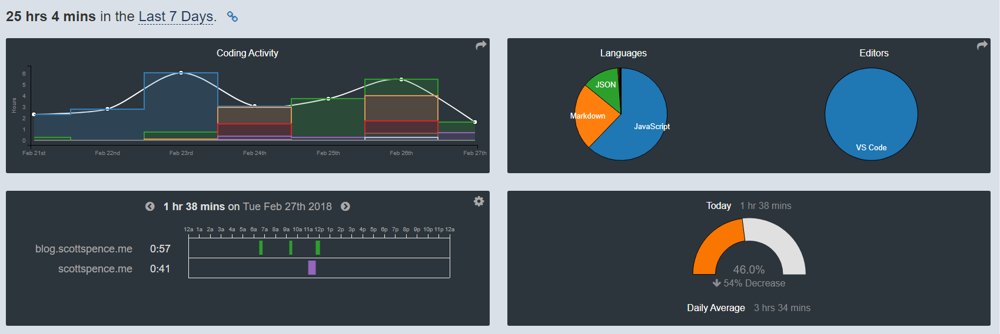

> Life moves pretty fast. If you don’t stop and look around once in a
> while, you could miss it. — Ferris Bueller.

I'm going to go over steps I have taken the help me with learning to
code ([again])

But fist, **preamble:**

### Let’s pick up a new skill, get a new job, all in a few months.

That was the overriding message I got when I started out in
freeCodeCamp it's a fun and exciting time and you will see a lot of
articles along the lines of 'hey look at me I was a school teacher
before, now I'm earning $100k as a engineer for x startup'

I don't mean this in a mean spirited or passive aggressive way, but if
you're starting out in web development and you surround yourself with
other people that want to achieve, they will, you know, achieve! 🙃

There's a bit of expectation vs reality here, if you are the kind of
person that can memorize the masses of information out there relating
to your chosen field then you're onto a winner, as for myself it's
repetition, repetition, repetition until it becomes habit, there's a
lot to be said about habits.

Forming habits takes time though, on [20161230] was when I decided to
take part in the #100DaysOfCode challenge I couldn't give
you an idea of how I felt then but reviewing the log entries I seemed
pretty confused and a little frustrated with it all.

That's not to say it hasn't been an enriching and life changing
experience for me.

Along the way I have met some truly awesome, inspiring people, happy
to help with any issues or problems you may have. The support I found
not just in the #100DaysOfCode community but the web dev
community as a whole is truly amazing.

### Patience

Patience is needed, instant gratification doesn’t work here, well at
least not for me. This will soon come to light if you start to compare
yourself to how other people (your cohorts) are progressing. You may
start to wonder why you are not progressing as fast as they appear to
be progressing, this will probably add to any anxiety you may have
about if you can do this thing or not. Do not concern yourself with
this and instead use that energy to focus on what you need to do,
code.

Different people progress at different rates and learn in different
ways.

Myself personally, I have found that I'm a visual learner (I've known
this for a long time actually) where to be able to 'join up'
concepts/paradigms I need to see them in action. This is why I will
always gush about courses by Wes Bos or Kent C. Dodds as they (among
many others) are great at explaining complex subject simply and
visually with their awesome [content on egghead.io] and wesbos.com.

YMMV however, so, find what works for you, find it and stick with it.

I have discovered recently that splitting my time between projects
wasn't really helping me so I decided to work on one particular
project each time I sat down to code.

The first time I did this I was struggling for hours with little to
nothing show for it, it felt futile and I was getting anxious about
not moving on, it was at this point when I would usually switch
context and work on something else - I found though that pushing that
little bit more was all I needed.

This was such psychological win for me, and gave me the confidence to
do more.

This has paid dividends as I now have 6+ demos of projects I have made
on [my portfolio]

### Busy work

I's easy to get distracted, things like apps for slack and email and
Twitter should not be opened, this will eat up your time. You have a
set amount of time to get something done, this will come to light when
you have finished reading your Twitter updates and Slack messages only
to realise you have fifteen minutes left to complete the task you set
out to do.

Soon into starting #100DaysOfCode I noticed this, what I
did was turn off all my phone notifications - if you need to check
something then check it, don't let your phone dictate where your
attention needs to be directed.

I turned off all browser notifications for Slack and Gmail. My phone
is left in another room on do not disturb whilst I work. Whilst in do
not disturb mode my phone will not make a noise unless someone on my
stared contacts list calls me. I pick up the phone in the afternoon to
check missed calls listen to voice mails and return any calls if
needed.

### Make time

Saying that you don't have the time to do 1-2 hours of coding a day
isn't going to help, it's though, but it's not about having the time
it's about making the time to do this. If it's important to you, you
will make time. You're the only one that can make these things happen.

### Balance

This weight gain is a mixture of illness at the start of 2017 and bad
diet choices thereafter. In the past I consciously opted for ‘healthy’
foods spending that little extra time deciding what to eat.

Whilst being ill at the start of 2017 I developed a bit of an
addiction to cereals (granola) 😬 it was quick and easy and I got a
quick boost from it.

Quick and easy soon became the norm after that 🙃 I have identified
this now and am making an effort to reduce this whilst also making
time for my development.

It’s a balance though 😀

### Tools

Some tools I use to help me 'get on' with what I've set out to do, a
while back I started using **Todoist**, this is great for when you're
scrolling through your Twitter feed and find a link to a really neat
looking tutorial or post you want to read but don't want to go down
the rabbit hole of working out where to document it, I will add it to
Todoist and come back to it when I get the capacity to work on it.

**WakaTime** is a great tool for quantifying your coding, pretty handy
when doing #100DaysOfCode, you get that instant feedback
on how you're doing for the day.

**RescueTime**, is handy for helping you identify your productivity
black holes and give you a nice breakdown of where your time is spent
on your computer and mobile.

### Life hacks

They just used to be called handy tips, now we need to call them hacks
so we can think they're cheating the system. In reality it's some
helpful rules to aid you if you need to find the extra time.

Get up early, I've taken to getting up an hour earlier than I used to
to squeeze an hour and a half out of the morning, I have a MI band
that I have set to vibrate to wake me at that time so I do not disturb
my wife.

Go to bed early, sleep is important kids, anyone that says otherwise
obviously doesn't get enough sleep 🙃

Have a mobile phone? Download podcasts, download video tutorials and
try to carve a bit of time out of your day to consume these, on your
way to work on the train on your lunch break. All great ways to fill
'empty time'. Whilst you're out running or at the gym, great times to
listen to podcasts.

### Good luck 👍

When I finished my last (VBA) contract in October I used that time to
fully immerse myself in web development.

At the time (which was good timing actually) I started a build to
learn project with two other remote developers, one in Egypt and one
in Serbia. We were all participating in the [Chingu] Voyage, this has
been a real eye opener for me and has given me the confidence to get
all [my portfolio] projects ready for potential employers to view.

Whilst taking part in the b2l Chingu project I got to treat this time
as a full time job which my WakaTime stats will attest. This was one
of the triggers for me that I should start applying for jobs as a
junior dev.

<!-- links -->

[again]: https://scottspence.me/about
[20161230]:
  https://github.com/spences10/100-days-of-code/commit/7dbefb608862401d4cb9e6ed11f539b44bedcdae
[chingu]: https://medium.com/chingu
[my portfolio]: https://scottspence.me/portfolio
[content on egghead.io]: https://egghead.io/instructors/kentcdodds
[wesbos.com]: http://wesbos.com/courses/
