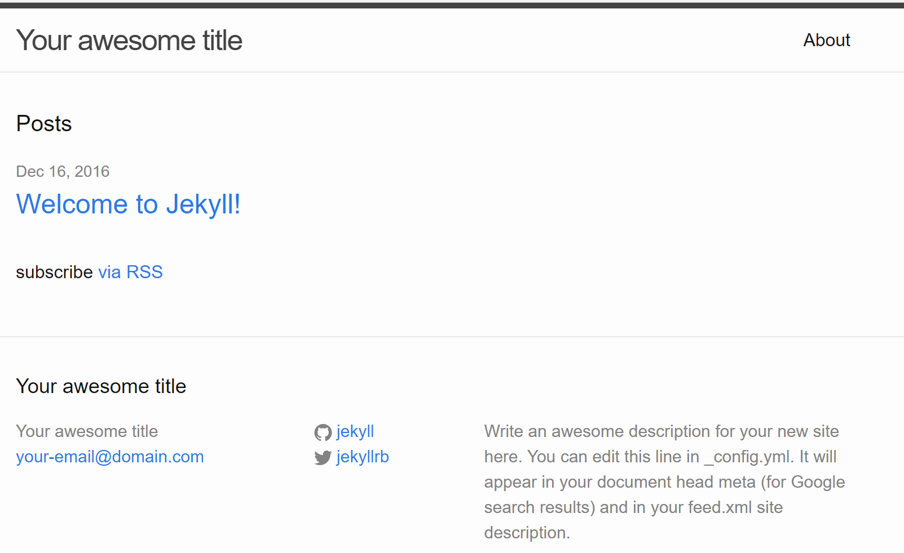
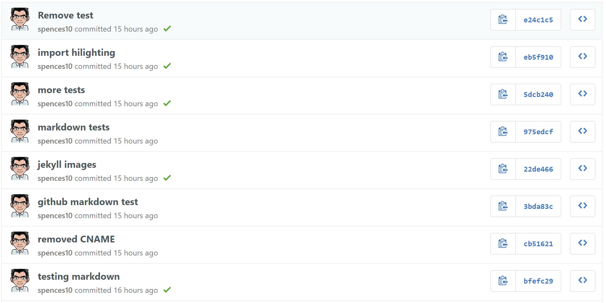

<figure class="floatRight">
	
	<!--<figcaption></figcaption>-->
</figure>

So I got to checking out Barry's blog and his Jekyll Now templates and tried to
make sense of the two so I could make my own, based off of the ideas I got from
Barry's blog.

## Development environment, enter Cloud 9

I tried to set up Ruby on my Windows machine and it didn't go well, then I tried
to set it up on my Raspberry Pi, that didn't go well either. Then I recalled
that I could have any number of different environments with
[Cloud9](https://c9.io/?redirect=0) so I set up a Ruby machine on there and
installed Jekyll, no problem

### Setup

It wasn't as simple as just going to the local host page as it's a cloud based
system so after som digging I found this from Jean-François L'Heureux
[jflheureux](https://github.com/jflheureux) on GitHub.

[https://www.jflh.ca/2016-01-18-running-jekyll-on-cloud9](https://www.jflh.ca/2016-01-18-running-jekyll-on-cloud9)

Basically you need to set up a Run Configuration on your c9 box, thanks for that
Jean-François.

## CSS

For some reason I thought that a Jekyll page didn't use CSS, well the reason may
have been that there was nothing like that in the 'vanilla' Jekyll site when you
run the `jekyll new myblog` you get very little in the was of bells and
whistles.

#### here is the base project


Running the following from the terminal on my Ruby development box

```
~ $ gem install jekyll bundler
~ $ jekyll new myblog
~ $ cd myblog
```

Omitting the `~/myblog $ bundle exec jekyll serve` and
`# => Now browse to http://localhost:4000` for reasons just mentioned.

Use the run configuration
`jekyll serve --host $IP --port $PORT --config _config.yml,_local_config.yml`

You get this:

#### new blog yay!



## Confusing

Jekyll uses Liquid templating language which, for someone like me was a bit
confusing. With me just getting used to the layout of a 'standard' web page I
was then presented with liquid 'tags' something I'm still not completely clear
on what some of them do.

`_layouts, _includes, meta.html`

WTF? I had no idea, I'm still not totally clear on the why, I add a default.html
then Jekyll complains that there's a missing meta.html file, I create a
\_includes folder and add an empty meta.html and it builds fine, no idea.

So after creating a `default.html` and then comparing with Jekyll Now and
Barry's sites I was able to piece together a `default.html`, `page.html` and
`post.html` which looked hideous so I then had to start with CSS on the page,I
took the majority of it from Barry's blog page with the intention of modifying
it to my own liking.

In the end I took quite a bit of CSS, the
[Meyer Reset](http://meyerweb.com/eric/tools/css/reset/) was something I knew
nothing of before starting this, now I think it's quite a handy thing to
have/know.

Variables, again I knew nothing about this before playing around with Jekyll but
really helped me understand CSS a little bit more than I did before.

Then stuff for analytics and Disqus, then there was stuff I added in that I
liked, like font-awesome and some Google fonts I like so I could have a nice
footer like the one in my CodePen portfolio I like.

## Markdown

Oh, it's not the right Markdown, why isn't is showing the GitHub Markdown
Scott?? Because you've used the `@import "highlights";` on your `style.css` oh
ok, so I'd prefer GitHub Markdown, ok no problem, go remove the
`@import "highlights";` from your `style.css` you'll be golden, no worries.
Queue a raft of commits with me dicking around with various combinations of
having corrected `_config.yml` entries it got pretty messy.



Currently I am still with the `_hilights.scss` in the `sass` folder which I'm
going to have to play around with to get it how I like it, hopefully I'll get to
learn a bit more about it all and understand how much of a tool I was.

## Preview

One last thing that bugged me that I couldn't do was the content preview thing
on the posts, it's partly why I went from Jekyll Now to my own vanilla build, I
was getting that first paragraph to show on the main blog page I found it
eventually, not on the `post.html` or the `default.html` no it was on the
`index.html` here:

` {``{ post.content | split:"<!--more-->" | first }``} `

Then add the `<!--more-->` tag after the first paragraph on your post, then I
added a class to float the image on the top of the post and flow around the
image, the CSS is this:

```
// see image in content preview
// only adjust width OR height so aspect ration is maintained
.floated{
  float: right;
  display: block;
  width: 33vw;
  max-width: 250px;
}
```

So I have the basics I think, still a fair bit to play around with but for now I
have what I need.
