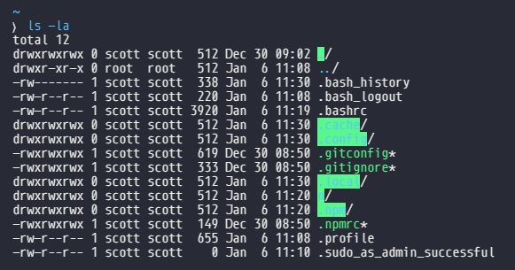
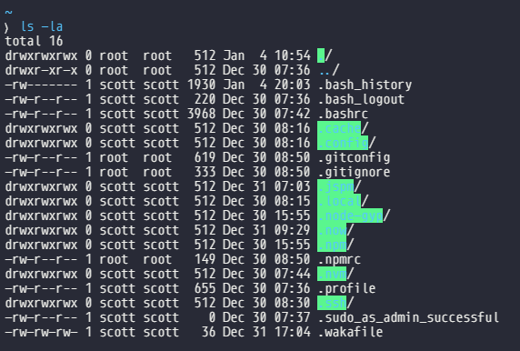

I'm a Windows user, I have been a Linux user as well but I have found that
Windows is a bit less neckbeardy for me, both have their pros and cons. One of
the big cons with Windows for me was when I started learning web development.

That was until Windows Subsystem Linux came along 👏

I love it, you can have a bash shell in Windows and run all your node apps
through it too

I nuked my laptop the other day as I was having issues with bash on Windows.
Related partly to using [nvm][slowbash] with WSL and something else that I'm
sure I'll figure out eventually but as of right now I'm still not entirely
certain what it was that was causing the slowness.

So I have had to set up my development environment again from scratch, luckily
for me I keep all my settings and config information in a GitHub
[repo][settingsrepo]

Here's how I set up Windows Subsystem Linux for my development environment.

This is my opinionated view on my setup and usage of WSL.

So, after installing [WSL][wslmsstore] from the Microsoft Store and adding your
default user fist thing is to update and upgrade all the things.

```sh
sudo apt update
sudo apt -y upgrade
```

If you've not used any Linux distributions before the `-y` in the upgrade
statement is to default the answer to yes for any prompts that are displayed in
the terminal.


You wont have these messages 👆

### Build tools

To compile and install native addons from npm you may also need to install build
tools, I need this for Gatsby images which uses `sharp` which in turn uses
`node-gyp`:

```sh
sudo apt-get install -y build-essential
```

### Install node

Installing node via the instructions given on the nodejs.org site doesn't give
the correct permissions for me, so when trying to `npm install` anything I get
errors, I found using `nvm` helps:

```sh
curl -o- https://raw.githubusercontent.com/creationix/nvm/v0.33.6/install.sh | bash
nvm install node
node -v
npm -v
```

If you find the startup time of bash [taking too long][slowbash] then take a
look at [using n][usen] instead.

### Install node with `n`

As it's a fresh install then we can go ahead and use [n-install] with:

```sh
curl -L https://git.io/n-install | bash
```

This will install the latest stable version of node 👍

Once the script is complete restart bash with:

```sh
. /home/<my_user_name>/.bashrc
```

Check your node and npm versions:

```sh
node -v && npm -v
```

### Install fish 🐟

Fish is now my go to shell purely for the auto complete/intellisense 👌 there's
also some nice themes you can get for it too.

```sh
sudo apt -y install fish
sudo apt -y upgrade
sudo apt -y autoremove
```

### Install Oh My Fish | OMF

Oh My Fish is like a package manager for Fish enabling the instal of packages
and themes.

```sh
curl -L https://get.oh-my.fish | fish
```

### Install OMF theme

```sh
omf install clearance
```

### The start of the beginning

Ok, so that is a basic setup for WSL, you'll probably want to get Git set up
now, I have been using SSH over HTTPS for a while now on WSL.

> At the time of writing this WSL Git integration with VSCode doesn't work so I
> have added a Git install to my windows machine, you can omit this and go full
> Git via the terminal but I really like the VSCode integration.

To get SSH set up on your machine take a look at this [handy SSH setup].

### Move your dotfiles

If you have all your [dotfiles] backed up in a GitHub repo then now is a good
time to add them to your WSL folder, the last times I did this I manually set
the permissions after moving each of the the files but have since discovered
[`rsync`][rsync]

```sh
rsync -avzh /mnt/c/Users/dotfiles/ ~/
```

That will copy the contents of my `dotfiles` folder to the `~/` (home) directory
in WSL, you can check them with:

```sh
ls -la ~/
```



I copied across my `.gitconfig`, `.gitignore` and `.npmrc` dotfiles pictured
here and you can see that the permissions are not consistent with the `.bashrc`
file.

So, the only way I know how to change the file permissions is with `chmod` to
get the ordinals of a similar file use `stat`:

```sh
stat -c "%a %n" ~/.*
```

This will list out all everything that begins with a `.` here's mine:

```sh
777 /home/scott/.
755 /home/scott/..
600 /home/scott/.bash_history
644 /home/scott/.bash_logout
644 /home/scott/.bashrc
777 /home/scott/.cache
777 /home/scott/.config
777 /home/scott/.gitconfig
777 /home/scott/.gitignore
777 /home/scott/.local
777 /home/scott/.npm
777 /home/scott/.npmrc
644 /home/scott/.profile
644 /home/scott/.sudo_as_admin_successful
```

I only want to change `.gitconfig`, `.gitignore` and `.npmrc` here so I'm going
to do this:

```sh
 chmod 644 .gitconfig .gitignore .npmrc
```

And now my files look like this. 👍



<!-- links -->

[slowbash]: https://github.com/Microsoft/WSL/issues/776
[wslmsstore]: https://www.microsoft.com/store/productId/9NBLGGH4MSV6
[usen]: https://github.com/Microsoft/WSL/issues/776#issuecomment-266112578
[settingsrepo]: https://github.com/spences10/settings
[dotfiles]: https://github.com/spences10/dotfiles
[handy ssh setup]: https://github.com/spences10/cheat-sheets/blob/master/git.md#how-to-authenticate-with-github-using-ssh
[rsync]: https://www.tecmint.com/rsync-local-remote-file-synchronization-commands/
[n-install]: https://github.com/mklement0/n-install
